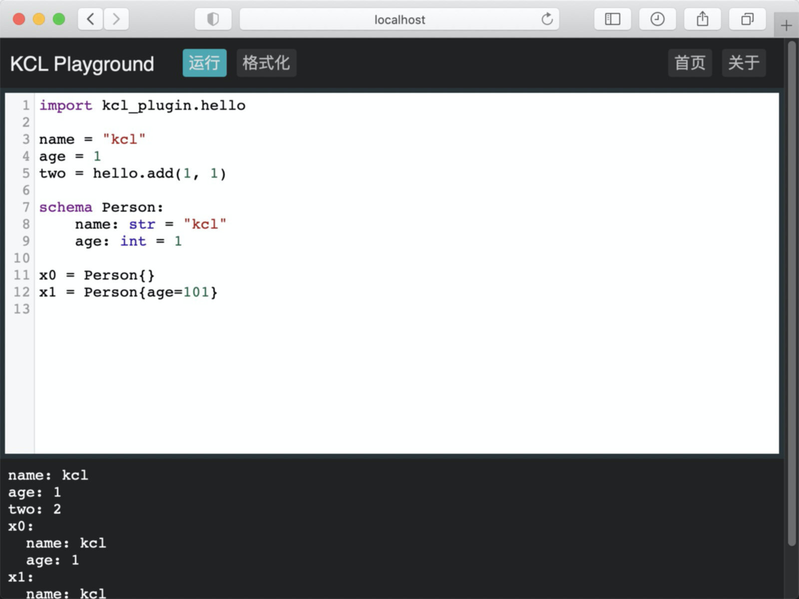

## kclvm-go: KCLVM binding for Go

- [Install kclvm](https://kusionstack.io/docs/user_docs/getting-started/install)
- [Install Go 17+](https://go.dev/dl/)

```
$ go version
go version go1.17.8 darwin/arm64
$ which kclvm
$ kclvm -m kclvm --version
kclvm version is 0.4.0; checksum: ***
```

## Run Test and hello.k

```
$ go test ./...
$ go run ./cmds/kcl-go
$ go run ./cmds/kcl-go run hello.k
```

## Run KCL Code with kclvm-go

```go
package main

import (
	"fmt"

	"kusionstack.io/kclvm-go"
)

func main() {
	yaml := kclvm.MustRun("hello.k", kclvm.WithCode(k_code)).First().YAMLString()
	fmt.Println(yaml)
}

const k_code = `
import kcl_plugin.hello

name = "kcl"
age = 1
two = hello.add(1, 1)

schema Person:
    name: str = "kcl"
    age: int = 1

x0 = Person {}
x1 = Person {
    age = 101
}
`
```

Output:

```
$ go run ./examples/hello/main.go 
age: 1
name: kcl
two: 2
x0:
    age: 1
    name: kcl
x1:
    age: 101
    name: kcl
```

## Playgrdound

```
$ go run ./cmds/kcl-go play
```



## Develop Guide

- [docs/readme.md](docs/readme.md)

## License

Apache License Version 2.0
